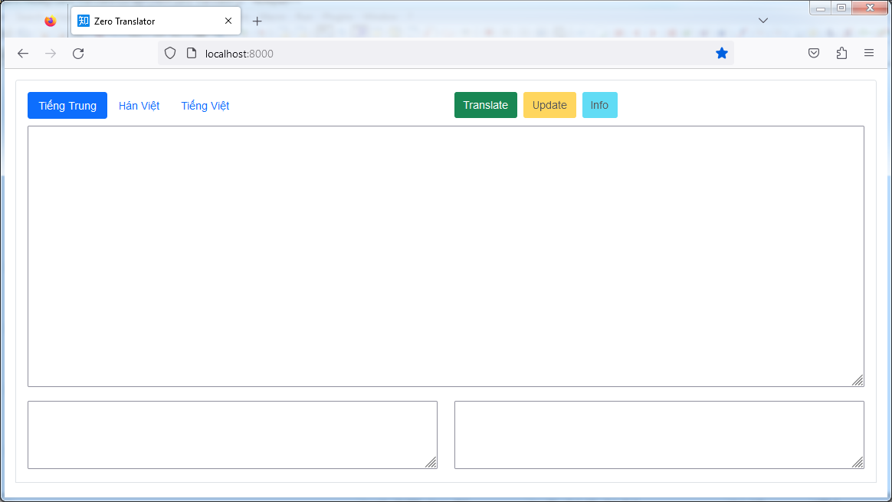

# Zero Translator (Node.js GUI Application)

Zero Translator is a GUI application for translating text using a local API and data from multiple CSV files.


## Features

- Translates text using a local API for translation.
- Uses data from multiple CSV files to translate texts in bulk.
- Provides a simple graphical user interface for easy translation tasks.

## Missing Features

- **Live Translation Updates:** Zero Translator currently does not support live updating text within the GUI. However, this feature is in active development and will soon allow users to instantly see translations as they type, providing a seamless and dynamic translation experience. Stay tuned for updates!
- If you have any ideas or suggestions, feel free to let us know! Your feedback is invaluable in shaping the future of Zero Translator.

### Installation Steps

1. Clone the repository:

   ```sh
   git clone https://github.com/baohoathanhto/zero-translator.git
   ```

2. Navigate to the project directory:

   ```sh
   cd zero-translator
   ```

3. Install the dependencies:

   ```sh
   npm install
   ```

### Usage

#### Graphical User Interface

You can use the Zero Translator GUI application to translate text using a graphical interface.

To launch the GUI, navigate to the project directory, run the following command:

```sh
node index
```

For more detailed usage instructions and options, refer to the [documentation](docs/README.md).

## Example



### Contributing

Contributions are welcome! Please refer to the [Contribution Guidelines](CONTRIBUTING.md) for more information.

### License

This project is licensed under the MIT License. See the [LICENSE](LICENSE) file for details.
